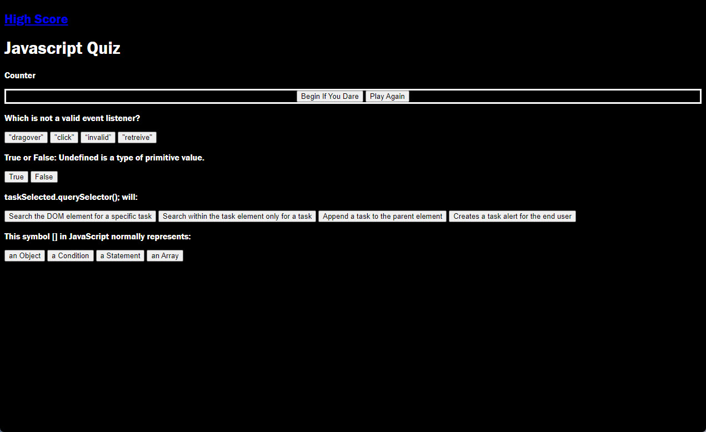

In the UTSA Bootcamp Challenge 4, we were given a directive of creating a JavaScript Quiz. In the Acceptance Criteria provided, there were a series of a requirements such as: selecting a start button, adding a timer, run through a series of questions, logging a high score and initials. 

This assignment came with no Starter Code, so the code was written by only me. I worked on the code using VS Code. GitHub hosts my code and can be found here: https://github.com/amhernandez1163/JavaScript-Quiz-4  and can be displayed: https://amhernandez1163.github.io/JavaScript-Quiz-4/ 

